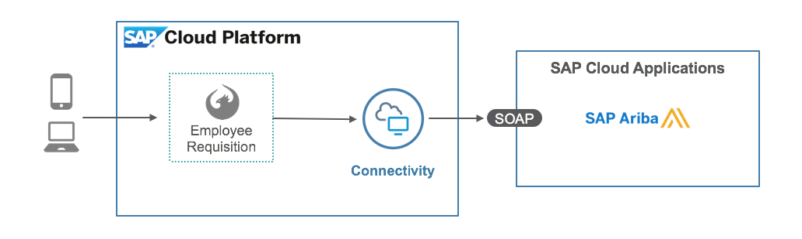

# SAP Ariba Employee Requisition

## Introduction

This is an SAP Cloud Platform Web application that exemplifies how a Fiori based app utilizing the SAP Ariba services could be created based on the Fiori Master Detail design principle.

The app relies on two soap based endpoints which are part of the salesdemo web service, one which provides the catalog of items (WSCatalogItemSearch) and one which is used to submit the requisition (RequisitionImportPull).  Each item from the catalog can be selected and then added to your cart which is accessible at the top right.  Because the app relies on web services as opposed to odata services, the Fiori Master Detail template provided by Web IDE cannot be used.  The corresponding tutorial walks the user through hand creating a master detail template as well as a full screen view contained within the same application.

## Prerequisites

1.    SAP Cloud Platform Account (Trial or Production)
2.    Access to a SAP Ariba system
4.    [Destinations configured for connecting to the Ariba API](#configure-the-destinations).

## Services Used
1.    SAP Cloud Platform Connectivity Service
2.    SAP Ariba



## Deploy the Application

1. In Web IDE Clone the Git repository by choosing the menu option File -> Git -> Clone Repository.
2. Provide the Git repository URL and then  choose Clone.
3. Right click on the project and choose Deploy -> Deploy to SAP Cloud Platform

## Configure the Destination

You need to configure an HTTP Connectivity Destination for the Ariba P2P API before running the project.
>*Note*: To learn more about how to configure the destination, see [SAP Cloud Platform Destinations Documentation] (https://help.hana.ondemand.com/help/frameset.htm?e4f1d97cbb571014a247d10f9f9a685d.html).

The HTTP API Destination looks like this:
```
Name=AribaSOAPAPI
Description=SOAP APIs from Ariba
Type=HTTP
URL=https://<Ariba instance>/Buyer/soap/salesdemo
User=<endpoint-user>
Password=<endpoint-password>
Authentication=BasicAuthentication
ProxyType=Internet
TrustAll=true
```
## Configure the Catalog Default Search

Within the file webapp/Component.js find the function getCatalogItems.  Set the parameters of the function call envelops.catalogItemSearchEnvelope according to your catalog setup.

## Access the application

If you deploy the application on the cloud, this is the URL pattern that you use to access it: `http://employeerequisition-<account>.<domain>`


* SAP Cloud Platform Documentation - https://help.hana.ondemand.com/
